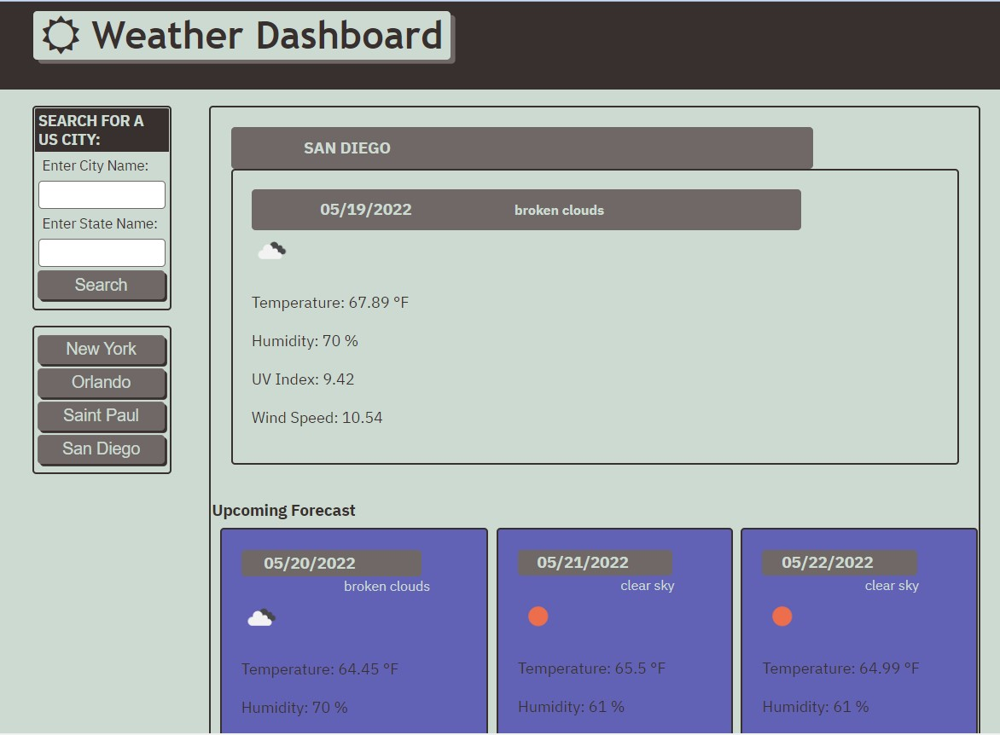

# Weather Dashboard

Authored by Charissa Hollister 05/19/2022

## Description

Easily and quickly see what the weather is and will be this week in any city in the United States by just entering the city and state of the desired location. The upcoming forecast has the icons and description to know what is coming at just a glance. This website stores previous search locations making it the perfect tool for planning a spontaneous road trip or checking on what weather family and friends are experiencing.  

## Technical Features

Simple and easy to read/understand quickly 
User can get weather about a city by entering the name 
City name and state fields set to empty to be ready for the next search 
Previous searches performed in the browswer are stored for future access and toggling between locations 
Icons and short descriptions to represent the anticipated weather 
Each day includes the Day's Temperature, Humidity, UV Index, and Wind Speed.  
Mobile responsiveness prevents city entry and upcoming forecast from becoming too small  
Font Awesome, Google fonts, Moment.js, and jquery used inside the webpage 
http://openweathermap.org API and icons used to populate weather predictions 

## Website Access

### URL Live Webpage:

https://charissahollister.github.io/Weather-Dashboard/

### GitHub Repo:

## Future improvement opportunities

Allow for cities outside of the US 
Have user enter city then select option from dropdown for which one they intend 
More weather details included 
Prevent repeat previous cities 
Include low and high ranges 
Improved mobility responsiveness 
Include severe weather alerts 
Open more comprehensive daily weather page when date selected 

### Minimum customer criteria

AS A traveler
I WANT to see the weather outlook for multiple cities
SO THAT I can plan a trip accordingly 
GIVEN a weather dashboard with form inputs 
WHEN I search for a city 
THEN I am presented with current and future conditions for that city and that city is added to the search history 
WHEN I view current weather conditions for that city 
THEN I am presented with the city name, the date, an icon representation of weather conditions, the temperature, the humidity, the wind speed, and the UV index 
WHEN I view the UV index 
THEN I am presented with a color that indicates whether the conditions are favorable, moderate, or severe 
WHEN I view future weather conditions for that city 
THEN I am presented with a 5-day forecast that displays the date, an icon representation of weather conditions, the temperature, the wind speed, and the humidity 
WHEN I click on a city in the search history 
THEN I am again presented with current and future conditions for that city 
